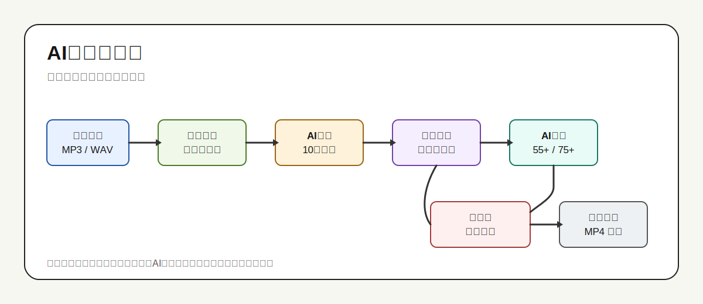
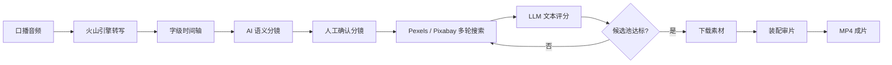

# Koubo Audio Video Maker

> 一个面向中文口播的低成本 AI 配画面工作流：给一段音频，自动转写、切分、找素材、让 LLM 评分，再装配成可审片的视频时间线。

docs/assets/download.png



## 为什么做这个

很多口播成片工具很好用，比如花生AI这类产品确实把流程做得很顺。但对个人创作者来说，最大的问题也很现实：贵。

所以我做了这个“开源低成本版”的口播成片工作流。你可以把它理解成一种非官方、自己动手、预算友好的替代路线：不追求黑箱一键到底，而是把每一步拆开，让 AI 判断、人类确认、文件可追溯。

这个项目的目标很直接：

- 尽量用免费或低成本组件完成口播配画面。
- 把“画面是否贴合文案”的判断交给 LLM，而不是简单关键词匹配。
- 每一步都有文件产物和流程单，方便人类检查、返工和接着跑。
- 下载素材支持恢复，超时后不会从头覆盖重下。

它不是一键魔法按钮，而是一套可审查、可替换、可暂停恢复的工作流。

## 适合谁

- 做中文口播、知识类短视频、讲述类视频的人。
- 想用 Pexels/Pixabay 免费素材给音频配画面的人。
- 想用 OpenCode、Codex 或其他 LLM 手动参与审核评分的人。
- 不想把选画面逻辑完全交给黑箱平台的人。

## 核心能力

- 单音频入口：输入 `.wav`、`.mp3`、`.m4a` 等音频文件即可开始。
- 火山引擎转写：生成字级时间轴，用于精确对齐分镜时间。
- 10 秒内语义分镜：按真实文本含义切分，不机械每 10 秒硬切。
- 多轮素材搜索：Pexels/Pixabay 多轮补缺，达标点不重复搜索。
- LLM 亲自评分：根据口播文本、搜索词、候选标题/tags/元数据打分。
- 无视觉审核：不生成 contact sheet，不靠看缩略图二次判断。
- 下载可恢复：已下载的非空 `video_XX.mp4` 会跳过，`.part` 半成品会重下。
- 装配审片：生成可检查、可替换素材的装配项目，并支持 MP4 成片导出。

## 工作流概览



## 快速开始

### 1. 安装到 Codex skills

把整个 `koubo-audio-video-maker` 文件夹复制到：

```text
C:\Users\<你的用户名>\.codex\skills\koubo-audio-video-maker
```

如果你使用的是其他系统，把它放到对应的 Codex skills 目录即可。

### 2. 准备依赖

需要本机能找到：

- Node.js
- Python 3.10+
- ffmpeg
- curl

检查依赖：

```powershell
node "$env:USERPROFILE\.codex\skills\koubo-audio-video-maker\scripts\doctor.js" --deps-only --json
node "$env:USERPROFILE\.codex\skills\koubo-audio-video-maker\scripts\transcribe\doctor.js" --deps-only --json
```

### 3. 配置 key

需要：

- `VOLCENGINE_API_KEY`：火山引擎语音转文字。
- `PEXELS_API_KEY`：Pexels 素材搜索。
- `PIXABAY_API_KEY`：Pixabay 素材搜索。

素材 key 可用脚本配置：

```powershell
powershell -NoProfile -ExecutionPolicy Bypass -File "$env:USERPROFILE\.codex\skills\koubo-audio-video-maker\scripts\set_api_keys.ps1"
```

### 4. 从音频创建项目

```powershell
$SKILL_DIR = "$env:USERPROFILE\.codex\skills\koubo-audio-video-maker"

node "$SKILL_DIR\scripts\start_project.js" `
  --audio "D:\your\narration.mp3" `
  --title "my-video" `
  --work-dir "D:\koubo-projects" `
  --engine auto `
  --check-keys
```

脚本会返回后续命令。按返回顺序执行即可，不要跳步骤。

## LLM 怎么参与

这个 skill 不是让代码自动“猜”素材好不好，而是让 LLM/Codex/OpenCode 读取候选信息后亲自评分：

- 口播原文是否匹配。
- 搜索关键词是否匹配。
- 视频标题、tags、作者信息、素材元数据是否匹配。
- 给每个候选打 0-100 分，并写理由。

一个素材点达标条件：

- 至少 3 个候选达到 `55+`。
- 其中至少 1 个候选达到 `75+`。

达标的点停止搜索；未达标的点进入下一轮补缺。

## 成本说明

这个项目主打低成本，不承诺绝对免费：

- Pexels/Pixabay 可提供免费素材，但要遵守各自 API 与素材授权规则。
- OpenCode 或其他工具中的免费模型可承担一部分 LLM 审核工作。
- 火山引擎转写、网络、API 调用可能产生费用或限制。

简单说：它不是买一个黑箱 SaaS，而是用公开工具和 AI 审核，把成本压到尽量低。

## 和黑箱口播成片工具的区别

| 维度 | 本项目 | 常见黑箱工具 |
| --- | --- | --- |
| 输入 | 单音频 | 音频/文稿 |
| 分镜 | 字级时间轴 + 语义切分 | 平台内部逻辑 |
| 画面判断 | LLM 按文本和候选元数据评分 | 多数不可见 |
| 素材来源 | Pexels/Pixabay，可追溯 | 平台素材库 |
| 恢复能力 | 下载可续跑，已下载文件跳过 | 取决于平台 |
| 成本 | 低成本、自备 key | 订阅或按量 |
| 可控性 | 高，产物都在本地 | 低到中 |

## 文档

- [安装说明](docs/INSTALL.md)
- [完整工作流](docs/WORKFLOW.md)
- [FAQ](docs/FAQ.md)
- [第一次上传 GitHub 指南](docs/GITHUB_UPLOAD.md)
- [发布文案](docs/LAUNCH_COPY.md)
- [命名和碰瓷边界](docs/TRADEMARK_NOTE.md)

## 免责声明

本项目不是哔哩哔哩、花生AI、Pexels、Pixabay、火山引擎或 OpenCode 的官方项目，也不与这些平台存在从属、授权、合作或背书关系。文中提到第三方产品名称只用于说明使用场景、成本对比和兼容语境。请遵守素材平台、API 服务和目标发布平台的条款。
